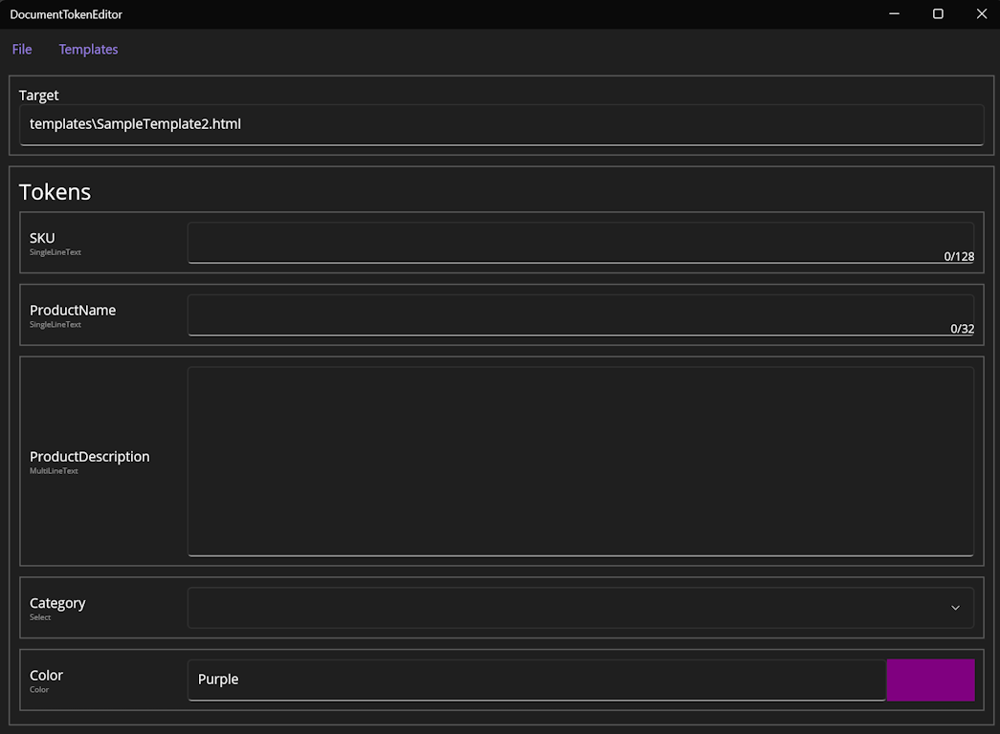

# DocumentTokenEditor

<div style="text-align:center">
    
</div>

A tool for editing tokens inside documents written in .NET MAUI/.NET8.

It supports custom token formats, quick access templates, and .dtes files which allow per file overrides to most settings.

## Usage

Start application and load a file to edit, the application will look for tokens in the file and present editable fields for those found.

By default the token formats are `{{TOKEN_NAME}}` and `{{TOKEN_NAME:TOKEN_TYPE}}`.

## Supported Token Types

- SingleLineText: Replaces token with a single line of text. (This is the default type)
- MultiLineText: Replaces the token with multiple lines of text.
- Select: Replaces the token with one of multiple predefined values. (This type requires the use of a .dtes file)
- Color: Replaces the token with a color. Also has a color preview built into it.

## Sample Document

```
Greetings, {{FirstName}}! It's been a long time since we talked, remember our old alma mater? GO BLUE AND {{Color:Color}}.

I'm reaching out to you about your cars extended warranty!

You can reach me at {{PhoneNumber}} or {{Email}}.

Feel free to read the first paragraph of my new book "{{BookName}}",
{{FirstParagraph:MultiLineText}}
```

## appsettings.json

```json5
{
  "TemplateService": {
    "Directory": "templates" // Directory to use when looking for templates
  },
  "TokenService": {
    "DefaultTokenFormat": {
      "Start": "{{", // Character/s specifying the start of a token
      "End": "}}", // Character/s specifying the end of a token
      "Divider": ":" // Character/s specifying the divider in tokens
    }
  }
}
```

## .dtes Files

.dtes files should be named the same as the file they are associated with. If the file is `MyDocument.html` than the .dtes file should be `MyDocument.html.dtes`

```json5
{
  "TokenSettings": {
    "TOKEN_NAME": {
      "Type": "SingleLineText", // Type of editor to use; See Token Types for valid values
      "MaxLength": 128, // Sets field max length; Supported by SingleLineText & MultiLineText
      "DefaultValue": "Lorem ipsum...", // Self-explanatory
      "Placeholder": "Placeholder Text", // Self-explanatory
      "NewlineToBr": true, // Converts newlines to <br>; Supported by MultiLineText
      "SelectOptions": { // Options that can be chosen from when Type=Select
        "Option1": "Option1Value", // Option1 is displayed in editor, Option1Value replaces token
        "Option2": "Option2Value" // Option2 is displayed in editor, Option2Value replaces token
      }
    }
  },
  "TokenFormat": { // Allows custom TokenFormat for file, works same as in appsettings.json
    "Start": "!!",
    "End": "!!"
  }
}
```
## Templates

By default templates are stored in the `templates` folder inside the application folder, this can be changed by changing the value of `TemplateService.Directory` in the `appsettings.json`.

The template system does not display `.dtes` files placed inside the template folder.

To add templates simply add files to the specified templates folder.

To remove templates simply remove files from the templates folder.
